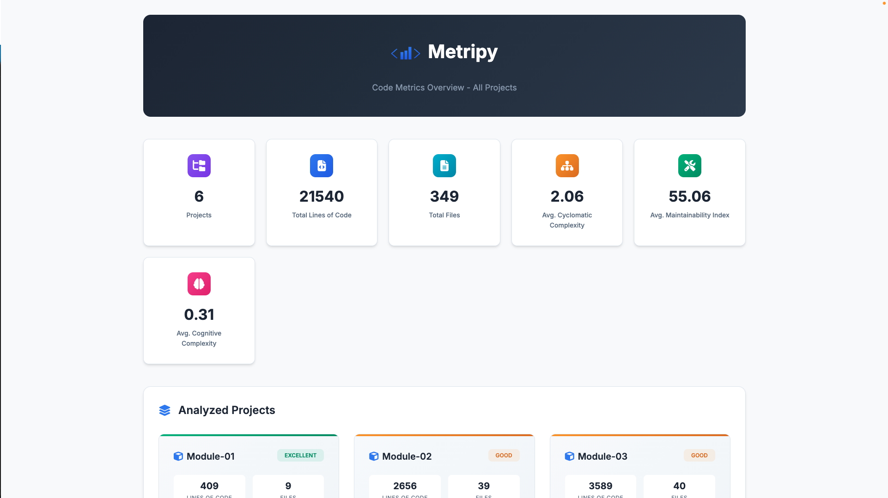
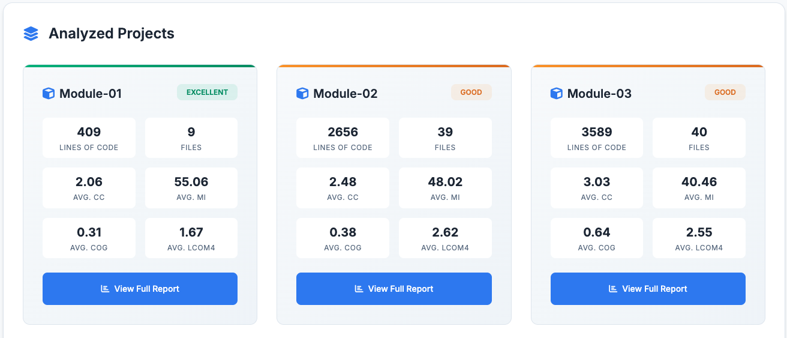

# Configuration

Metripy uses JSON configuration files to specify analysis settings. You can configure multiple projects in a single file.

## Quick Configuration

Create a minimal `metripy.json` file:

```json
{
    "configs": {
        "my-project": {
            "base_path": "./",
            "includes": ["src/"],
            "extensions": ["py"],
            "reports": {
                "html": "./build/report"
            }
        }
    }
}
```

Run with:

```bash
metripy --config=metripy.json
```

## Configuration Structure

### Root Object

```json
{
    "configs": {
        "project-name-1": { /* project config */ },
        "project-name-2": { /* project config */ }
    },
    "html_index": "./build/index.html"
}
```

The `configs` object contains named project configurations. Each key is a project name.

The optional `html_index` generates a central overview page linking to all project reports.

## Project Configuration

### Basic Settings

#### `base_path` (required)
Base directory to analyze.

```json
"base_path": "./"
```

Can be relative to the config file or absolute:

```json
"base_path": "/absolute/path/to/project"
```

#### `includes` (optional)
Array of paths to include, relative to `base_path`.

```json
"includes": [
    "src/",
    "lib/"
]
```

If not specified, all files matching `extensions` are included.

#### `excludes` (optional)
Array of patterns to exclude.

```json
"excludes": [
    "__pycache__",
    "node_modules",
    "*.test.py",
    "build/",
    ".venv"
]
```

#### `extensions` (required)
Array of file extensions to analyze (without dots).

```json
"extensions": ["py"]
```

Multiple extensions:

```json
"extensions": ["py", "pyw"]
```

### Git Analysis

Enable Git history analysis:

```json
"git": {
    "branch": "main"
}
```

Options:
- `branch`: Git branch to analyze (default: `main`)

To disable git analysis, omit the `git` key.

### Dependency Analysis

#### Python (pip)

Analyzes `requirements.txt` or `pyproject.toml`:

```json
"pip": true
```

#### JavaScript/TypeScript (npm)

Analyzes `package.json`:

```json
"npm": true
```

#### PHP (Composer)

Analyzes `composer.json`:

```json
"composer": true
```

### Reports

Configure output formats and locations.

#### HTML Report

```json
"reports": {
    "html": "./build/report/my-project"
}
```

Generates an interactive HTML dashboard at the specified path.

#### JSON Report

```json
"reports": {
    "json": "./build/json-report/my-project.json"
}
```

Exports full analysis results as JSON.

#### Git JSON Report

```json
"reports": {
    "json-git": "./build/json-report/my-project-git.json"
}
```

Exports only git analysis as JSON.

#### CLI Report

```json
"reports": {
    "cli": "."
}
```

Prints a color-coded summary directly to the terminal, including:
- Overview with stacked bar charts for all metrics
- Top offenders (worst files and functions)
- Coupling metrics and instability
- Code smells summary
- Git metrics (if enabled)
- Dependency status (if enabled)

The value is any string to signal that it is enabled, the output goes to stdout.

#### GitLab Code Quality Report

```json
"reports": {
    "gl-codequality-report": "./build/gl-codequality.json"
}
```

Generates a JSON report compatible with GitLab's Code Quality feature. Issues are displayed in merge request diffs.

#### Multiple Reports

```json
"reports": {
    "html": "./build/report/my-project",
    "json": "./build/json-report/my-project.json",
    "json-git": "./build/json-report/my-project-git.json",
    "csv": "./build/csv-report/my-project.csv",
    "cli": ".",
    "gl-codequality-report": "./build/gl-codequality.json"
}
```

### HTML Project Index

When analyzing multiple projects, generate a central overview page:

```json
{
    "configs": { /* multiple project configs */ },
    "html_index": "./build/project-index/index.html"
}
```

The index page provides an overview of all analyzed projects at a glance:



**Features:**
- **Aggregate statistics**: Total LOC, files, average complexity, maintainability index, and cognitive complexity across all projects
- **Project cards**: Each project displays its metrics with a health status badge
- **Navigation**: Click any project card to view its detailed HTML report



**Health Status Calculation:**

Health status is calculated using a weighted composite score:
- Maintainability Index (40%)
- Cyclomatic Complexity (25%)
- Cognitive Complexity (25%)
- LCOM4 (10%)

The resulting score maps to: `excellent` (≥80), `good` (≥60), `fair` (≥40), `poor` (<40).

**Note**: The `html_index` option is defined at the root level, not inside individual project configs.

### Trend Tracking

Enable historical tracking to see trends over time:

```json
"trends": "./build/historical-json-report/my-project.json"
```

Metripy will:
1. Read previous analysis from this file
2. Compare with current analysis
3. Calculate deltas and trends

## Complete Example

```json
{
    "configs": {
        "metripy": {
            "base_path": "./",
            "includes": [
                "metripy/"
            ],
            "excludes": [
                "__pycache__",
                "*.pyc",
                ".git",
                ".venv",
                "build/"
            ],
            "extensions": [
                "py"
            ],
            "pip": true,
            "git": {
                "branch": "main"
            },
            "reports": {
                "html": "./build/report/metripy",
                "json": "./build/json-report/metripy.json",
                "json-git": "./build/json-report/metripy-git.json"
            },
            "trends": "./build/historical-json-report/metripy.json"
        }
    }
}
```

## Multi-Project Configuration

Analyze multiple projects in one run:

```json
{
    "configs": {
        "backend": {
            "base_path": "./backend",
            "includes": ["src/"],
            "extensions": ["py"],
            "pip": true,
            "git": {"branch": "main"},
            "reports": {
                "html": "./build/report/backend"
            }
        },
        "frontend": {
            "base_path": "./frontend",
            "includes": ["src/"],
            "extensions": ["ts", "tsx"],
            "npm": true,
            "git": {"branch": "main"},
            "reports": {
                "html": "./build/report/frontend"
            }
        },
        "shared-library": {
            "base_path": "./shared",
            "includes": ["lib/"],
            "extensions": ["py"],
            "reports": {
                "html": "./build/report/shared"
            }
        }
    },
    "html_index": "./build/report/index.html"
}
```

The `html_index` generates a central dashboard linking to all project reports with aggregate statistics.

## Git-Only Configuration

Analyze only Git history (no code metrics):

```json
{
    "configs": {
        "project-git": {
            "base_path": "./",
            "git": {
                "branch": "main"
            },
            "reports": {
                "json-git": "./build/json-report/project-git.json"
            }
        }
    }
}
```

## Command-Line Arguments

### Config File

```bash
metripy --config=path/to/config.json
```

### Inline Arguments

You can override config file settings via command line, or omit a config file and define the full config via only arguments:

```bash
# Set project-specific values
metripy --configs.myproject.base_path="./src" --configs.myproject.extensions="py"

# Set boolean flags
metripy --quiet     # Suppress output
metripy --debug     # Enable debug logging
metripy --version   # Show version
metripy --help      # Show help
```

**Note**: Use dot notation for nested properties:

```bash
--configs.PROJECT_NAME.PROPERTY=VALUE
--configs.PROJECT_NAME.git="develop"
--configs.PROJECT_NAME.reports.html="./output"
--configs.PROJECT_NAME.trends="./path_to_old_config.json"
```

The config file contains has pip anaylsis enabled, but for your run you wish to disable it, use:
```bash
--configs.PROJECT_NAME.pip=false
```
It does not have pip analysis enabled, but for your run you wish to enable it:
```bash
--configs.PROJECT_NAME.pip
--configs.PROJECT_NAME.pip=true
```

To add a value to the list properties (includes, excludes, extension) just use PROPERTY=VALUE:
```bash
--configs.PROJECT_NAME.includes="some directory"
```

To empty a list property just use PROPERTY="". Afterwards you can add new values with the above:
```bash
--configs.PROJECT_NAME.includes=""
```


### Global Flags

| Flag | Description |
|------|-------------|
| `--quiet` | Suppress non-error output |
| `--debug` | Enable debug logging |
| `--version` | Display version and exit |
| `--help` | Show help message and exit |

## Exit Conditions (Quality Gates)

Define conditions that cause the analysis to exit with specific exit codes when thresholds are exceeded. This is essential for CI/CD integration to fail builds when code quality degrades.

### Basic Structure

```json
{
    "configs": { /* project configs */ },
    "failure": {
        "EXIT_CODE": [
            {
                "value": "METRIC_NAME",
                "severity": "SEVERITY_LEVEL",
                "amount": THRESHOLD
            }
        ]
    }
}
```

The `failure` configuration is defined at the root level alongside `configs`.

### How It Works

1. Metripy counts how many files/classes/functions fall into each severity category for each metric
2. For each failure condition, it checks if the count meets or exceeds the threshold
3. All conditions are evaluated and reported before exiting
4. The highest applicable exit code is returned

### Available Metrics

#### File-Level Metrics

| Metric | Description |
|--------|-------------|
| `file_loc` | Lines of code per file |
| `file_cyclomatic_complexity` | Average cyclomatic complexity per file |
| `file_maintainability_index` | Maintainability index per file |
| `file_cognitive_complexity` | Average cognitive complexity per file |

#### Class-Level Metrics

| Metric | Description |
|--------|-------------|
| `class_loc` | Lines of code per class |
| `class_cyclomatic_complexity` | Total cyclomatic complexity per class |
| `class_lcom4` | Lack of Cohesion of Methods (LCOM4) per class |

#### Function-Level Metrics

| Metric | Description |
|--------|-------------|
| `function_loc` | Lines of code per function |
| `function_cyclomatic_complexity` | Cyclomatic complexity per function |
| `function_maintainability_index` | Maintainability index per function |
| `function_cognitive_complexity` | Cognitive complexity per function |

### Severity Levels

| Severity | Description |
|----------|-------------|
| `good` | Excellent quality, no issues |
| `ok` | Acceptable quality |
| `warning` | Needs attention |
| `critical` | Requires immediate action |

### Examples

#### Fail on Critical Functions

Exit with code 1 if there are any functions with critical complexity:

```json
{
    "failure": {
        "1": [
            {
                "value": "function_cyclomatic_complexity",
                "severity": "critical",
                "amount": 1
            }
        ]
    }
}
```

#### Multiple Conditions per Exit Code

Exit with code 1 if there are too many complex functions OR large functions:

```json
{
    "failure": {
        "1": [
            {
                "value": "function_cyclomatic_complexity",
                "severity": "critical",
                "amount": 5
            },
            {
                "value": "function_loc",
                "severity": "critical",
                "amount": 3
            }
        ]
    }
}
```

#### Different Exit Codes for Different Severities

Use different exit codes for different severity levels:

```json
{
    "failure": {
        "1": [
            {
                "value": "function_cyclomatic_complexity",
                "severity": "warning",
                "amount": 20
            }
        ],
        "2": [
            {
                "value": "function_cyclomatic_complexity",
                "severity": "critical",
                "amount": 5
            }
        ]
    }
}
```

If both conditions are met, the highest exit code (2) is returned.

#### Complete CI/CD Example

```json
{
    "configs": {
        "my-project": {
            "base_path": "./",
            "includes": ["src/"],
            "extensions": ["py"],
            "reports": {
                "html": "./build/report",
                "gl-codequality-report": "./build/gl-codequality.json"
            }
        }
    },
    "failure": {
        "1": [
            {
                "value": "function_cyclomatic_complexity",
                "severity": "critical",
                "amount": 1
            },
            {
                "value": "function_maintainability_index",
                "severity": "critical",
                "amount": 1
            },
            {
                "value": "class_lcom4",
                "severity": "critical",
                "amount": 5
            }
        ]
    }
}
```

### CI/CD Integration

#### GitLab CI

```yaml
code-quality:
  stage: test
  script:
    - pip install metripy
    - metripy --config=metripy.json
  artifacts:
    reports:
      codequality: build/gl-codequality.json
  allow_failure:
    exit_codes:
      - 1  # Allow exit code 1 as warning
```

#### GitHub Actions

```yaml
- name: Code Quality Check
  run: |
    pip install metripy
    metripy --config=metripy.json
  continue-on-error: false
```

## Best Practices

### 1. Exclude Test Files

If you don't want to analyze tests:

```json
"excludes": [
    "tests/",
    "test_*.py",
    "*_test.py"
]
```

### 2. Multiple Configs for Different Purposes

Create different config files for different use cases:

```bash
metripy.full.json      # Full analysis with Git and dependencies
metripy.quick.json     # Code metrics only
metripy.git.json       # Git analysis only
```

### 3. Use Relative Paths

Use relative paths for portability:

```json
"base_path": "./",
"reports": {
    "html": "./build/report"
}
```

### 4. Document Your Config

Add a README section explaining your config:

```markdown
## Running Code Metrics

```bash
metripy --config=metripy.json
```

Reports are generated in `./build/report/`
```

## Troubleshooting

### Config Not Found

Ensure the path to config file is correct:

```bash
# Use absolute path
metripy --config=/full/path/to/metripy.json

# Or relative to current directory
metripy --config=./config/metripy.json
```

### Invalid JSON

Validate your JSON using a linter:

```bash
# Online: jsonlint.com
# Or use Python
python -m json.tool metripy.json
```

### No Files Found

Check your `includes`, `excludes`, and `extensions`:

```json
"includes": ["src/"],        // Does this path exist?
"excludes": ["src/"],        // Are you excluding what you included?
"extensions": ["py"]         // Does this match your files?
```

### Git Branch Not Found

Ensure the specified branch exists:

```bash
git branch -a | grep main
```

Or use your default branch:

```json
"git": {
    "branch": "master"  // or "develop", etc.
}
```

---

[View Features →](features) | [Getting Started →](getting-started)

